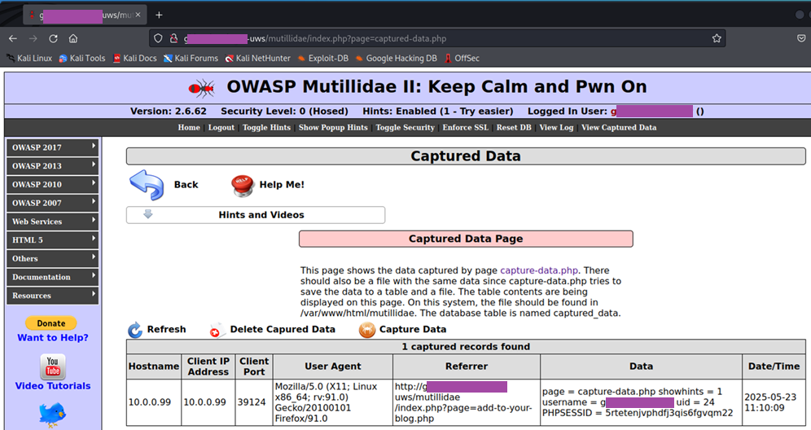

# Client-side explotation 

## 1. Stored XSS – Page Redirection

A stored cross-site scripting payload was inserted into the “Add to Your Blog” input field within the Mutillidae application. The script was designed to automatically redirect the visitor’s browser to an external address when the page was viewed. 

Once the entry was submitted and stored in the database, the injected JavaScript executed each time the page was loaded, confirming that the payload had been successfully stored and triggered by subsequent visits.

   
  <b>Image 2 – VMnet8 Configuration</b>

The browser on the victim workstation was opened, and navigation to the same page resulted in an automatic redirection to the specified destination. 

The behavior demonstrated that persistent cross-site scripting could be leveraged to control client-side navigation without user interaction. The test confirmed that inadequate input sanitization allowed executable script content to be saved and rendered as active code within the application’s output.

## 2. Session Token Capture via XSS

## 3. Cross-Site Request Forgery (CSRF) Exploit

## 4. BeEF Setup Verification

## 5. Browser Hook Demonstration

## 6. Virtualization Detection

## 7. Social Engineering Module Execution

