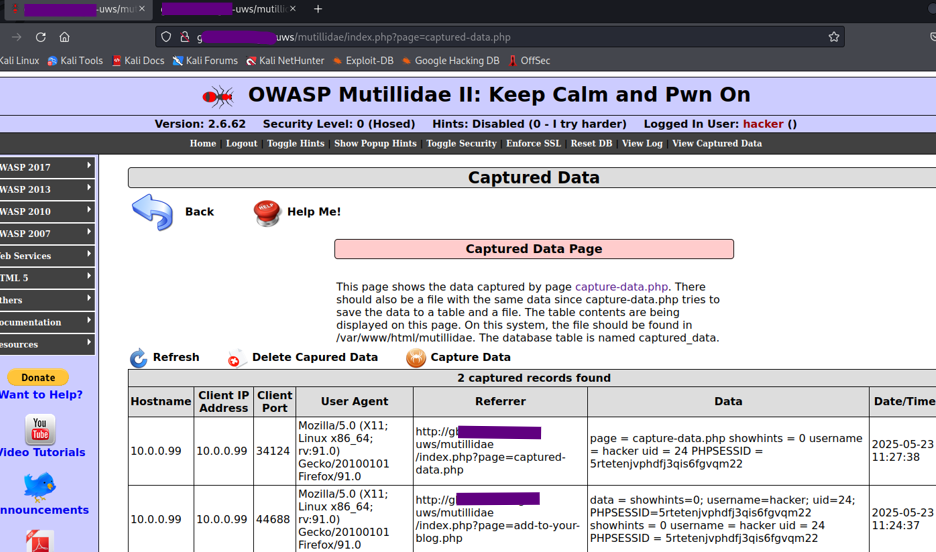

# Client-side explotation 

## 1. Stored XSS – Page Redirection

A stored cross-site scripting payload was inserted into the “Add to Your Blog” input field within the Mutillidae application. The script was designed to automatically redirect the visitor’s browser to an external address when the page was viewed. 

Once the entry was submitted and stored in the database, the injected JavaScript executed each time the page was loaded, confirming that the payload had been successfully stored and triggered by subsequent visits.

   
  <b>Image 1 – Captured-data page showing exfiltrated session cookies</b>

The browser on the victim workstation was opened, and navigation to the same page resulted in an automatic redirection to the specified destination. 

The behavior demonstrated that persistent cross-site scripting could be leveraged to control client-side navigation without user interaction. The test confirmed that inadequate input sanitization allowed executable script content to be saved and rendered as active code within the application’s output.

## 2. Session Token Capture via XSS

The Mutillidae database was first reset to remove any residual entries and to ensure that no previously stored payloads would interfere with the experiment. Once the environment was clean, the “Add to your blog” page was opened, and a simple redirect script was submitted as an initial test. This step was performed to verify that stored scripts were being preserved by the application and executed when the page was later viewed by another user, confirming the existence of a stored XSS vulnerability.

After the execution of the test was confirmed, the token capture script provided in the Mutillidae test collection was located and opened in a text editor. Its default destination address was replaced with the hostname of the attacker system so that any data collected by the victim’s browser would be transmitted back to that host. The modified version of this script was then submitted as a blog entry from the attacker account, ensuring that it would be stored in the database and served to any visitor viewing the blog page.

On the victim workstation, a separate user account was used to access the same blog section. When the victim’s browser displayed the stored entry, the injected script was executed in the victim’s context. The browser automatically read the site cookies associated with the active session and sent them to the capture endpoint hosted on the attacker’s machine. The request was received and processed by the capture script, which logged the transmitted data in the application’s captured-data table.

   
  <b>Image 1 – Captured-data page showing exfiltrated session cookies</b>

The capture record displayed the victim’s IP address, browser user agent, referring page, and the transmitted cookie string along with a timestamp. The presence of this information confirmed that the victim’s session data had been successfully retrieved through stored XSS and exfiltrated via a background HTTP POST

## 3. Cross-Site Request Forgery (CSRF) Exploit

## 4. BeEF Setup Verification

## 5. Browser Hook Demonstration

## 6. Virtualization Detection

## 7. Social Engineering Module Execution

